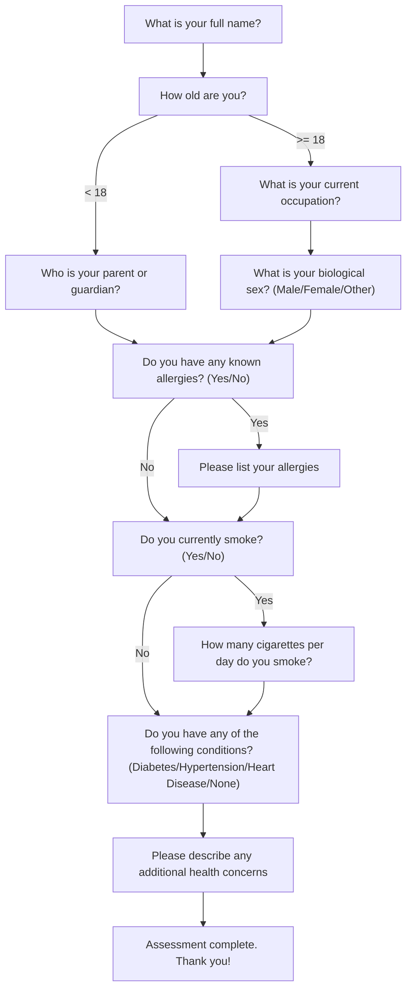

# Flowchart Conversational Agent

A conversational AI agent built with [Google ADK](https://google.github.io/adk-docs/) that parses a Mermaid flowchart, asks questions following the flowchart logic, stores answers in SQLite, and skips already-answered questions.

## How It Works

The agent reads a Mermaid flowchart definition and uses it to drive a conversation. It:

- Walks the flowchart graph node-by-node, asking one question per turn
- Handles conditional branching (e.g., age-based paths, yes/no follow-ups)
- Persists answers to SQLite so users can resume across sessions
- Skips questions that have already been answered

The included demo flowchart is a health intake assessment with 10 questions covering name, age, allergies, smoking status, and health conditions.



## Prerequisites

- Python 3.11+
- [uv](https://docs.astral.sh/uv/getting-started/installation/)
- A Google AI Studio API key ([get one here](https://aistudio.google.com/apikey))

## Setup

1. **Clone and enter the project:**

   ```bash
   cd flowchart_project
   ```

2. **Add your API key** to the `.env` file:

   ```
   GOOGLE_API_KEY=your_actual_api_key
   ```

3. **Install dependencies:**

   ```bash
   uv sync
   ```

## Running the Agent

### ADK Web UI (recommended)

From the project root (`flowchart_project/`):

```bash
uv run adk web .
```

This starts a local server at `http://127.0.0.1:8000` with a browser-based chat interface. Select `flowchart_agent` from the agent dropdown and start chatting.

To use a different port:

```bash
uv run adk web --port 8080 .
```

### ADK CLI

```bash
uv run adk run flowchart_agent
```

This runs the agent in your terminal for a text-based conversation.

## What to Expect

1. The agent greets you and asks your name (Q1)
2. It asks your age (Q2), then branches:
   - **Under 18** → asks for parent/guardian name, then skips occupation
   - **18 or older** → asks occupation, then biological sex
3. Asks about allergies — if **Yes**, asks you to list them; if **No**, skips that
4. Asks about smoking — if **Yes**, asks cigarettes per day; if **No**, skips that
5. Asks about existing conditions, then any additional health concerns
6. Summarizes the completed assessment

### Special Commands During the Chat

- **"What's my status?"** — shows how many questions you've answered
- **"Start over"** / **"Restart"** — clears all answers and begins again
- **"I want to change my answer to Q3"** — updates a previous answer

### Resuming a Session

Answers are saved to SQLite (`flowchart_agent/database/answers.db`). If you stop and restart the agent, it loads your previous answers and picks up where you left off.

## Project Structure

```
flowchart_project/
├── pyproject.toml                          # uv/hatch project config
├── .env                                    # GOOGLE_API_KEY
└── flowchart_agent/
    ├── __init__.py                         # Exports root_agent
    ├── agent.py                            # LlmAgent definition + init callback
    ├── prompt.py                           # System instruction
    ├── flowchart/
    │   ├── parser.py                       # Mermaid text → graph dict
    │   ├── navigator.py                    # Graph traversal + branching logic
    │   └── sample_flowchart.md             # Demo health assessment flowchart
    ├── tools/
    │   └── flowchart_tools.py              # 6 ADK function tools
    └── database/
        └── models.py                       # SQLite schema + CRUD
```

## Using a Custom Flowchart

Replace the contents of `flowchart_agent/flowchart/sample_flowchart.md` with your own Mermaid flowchart. The parser supports:

- **Node definitions:** `Q1["Your question text here"]`
- **Unconditional edges:** `Q1 --> Q2`
- **Conditional edges:** `Q1 -->|"Yes"| Q2` or `Q1 -->|">= 18"| Q3`
- **Terminal nodes:** Any node with "complete", "end", "finish", or "thank" in its text
- **Question type inference:** `(Yes/No)` → yes/no, `(A/B/C)` → multiple choice, "how many" → numeric, otherwise → free text
