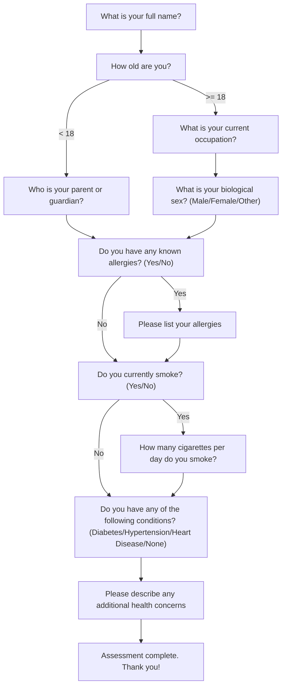

```mermaid
flowchart TD
    Q1["What is your full name?"]   
    Q2["How old are you?"]
    Q3["What is your biological sex? (Male/Female/Other)"]
    Q4_minor["Who is your parent or guardian?"]
    Q4_adult["What is your current occupation?"]
    Q5["Do you have any known allergies? (Yes/No)"]
    Q6["Please list your allergies"]
    Q7["Do you currently smoke? (Yes/No)"]
    Q8["How many cigarettes per day do you smoke?"]
    Q9["Do you have any of the following conditions? (Diabetes/Hypertension/Heart Disease/None)"]
    Q10["Please describe any additional health concerns"]
    END_COMPLETE["Assessment complete. Thank you!"]

    Q1 --> Q2
    Q2 -->|"< 18"| Q4_minor
    Q2 -->|">= 18"| Q4_adult
    Q4_minor --> Q5
    Q4_adult --> Q3
    Q3 --> Q5
    Q5 -->|"Yes"| Q6
    Q5 -->|"No"| Q7
    Q6 --> Q7
    Q7 -->|"Yes"| Q8
    Q7 -->|"No"| Q9
    Q8 --> Q9
    Q9 --> Q10
    Q10 --> END_COMPLETE
```
